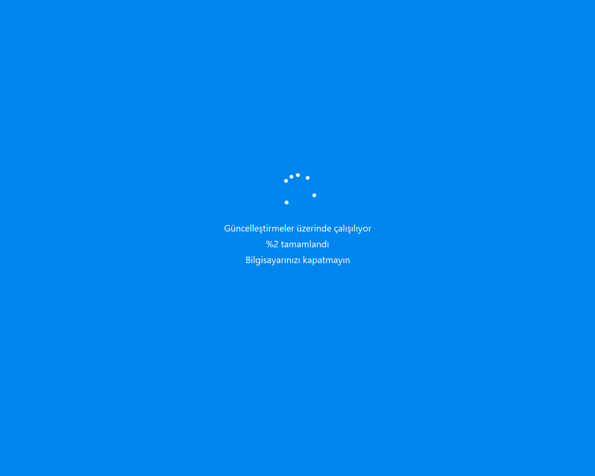
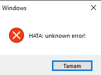
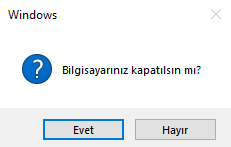
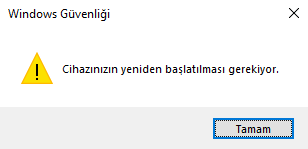
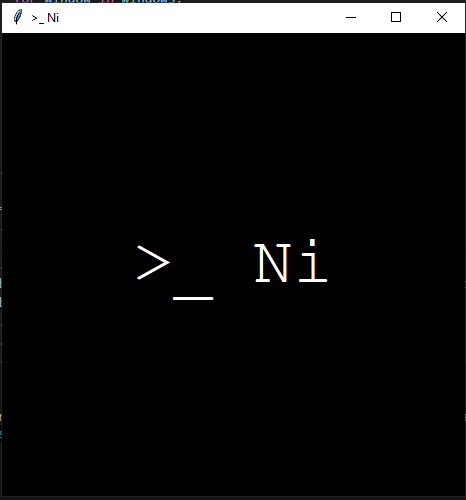

# 🖥️ Akilli-Tahta-Fatihi

> 📌 README Language: Turkish/Türkçe 🇹🇷

&nbsp;

**Python** ile geliştirilmiş deneysel bir Windows **prank/automation** yazılımı.

Bu proje eski okul günlerinden kalma bir deneydir. İlk fikri, davranışları olasılıksal olarak değişebilen evrimsel bir sistem simülasyonu üzerine kuruluydu. Daha sonra lise döneminde akıllı tahtalarda eğlence ve deney amacıyla kullanılan nostaljik bir projeye dönüştü.


*Ni (bi-Ni-ary) tarafından 2025-2026 yıllarında **Windows 10 x64** için geliştirilmiştir.*

*Diğer Windows sürümlerinde de büyük ölçüde çalışması beklenmektedir **ancak tüm sürümlerde test edilmemiştir.***


## ⚠️ Uyarı

**Bu proje kendiliğinden durmaz, bazı sistem etkileşimleri gerçekleştirebilir ve kullanıcı deneyimini değiştirebilecek davranışlar içerebilir.**

- Yalnızca size ait veya kullanım izniniz olan cihazlarda çalıştırın.
- Test amacıyla güvenli ortamlarda kullanın.
- Kullanımdan doğabilecek sonuçlardan kullanıcı sorumludur.

**Bu proje eğitim, deney ve nostaljik amaçlarla paylaşılmıştır.**


## 🔒 Güvenlik, Gizlilik ve Ağ Kullanımı

Bu proje herhangi bir kullanıcı verisi **toplamaz**, **kaydetmez**
ve herhangi bir uzak sunucuya **göndermez.**

Programın normal çalışma mantığında herhangi bir ağ
iletişimi **bulunmamaktadır.**

Bazı eventler kullanıcı deneyimi amacıyla internet
tarayıcısını açabilir. Bu durumda internet erişimi,
yalnızca ilgili event tetiklendiğinde `Google` ve `YouTube`
gibi servisleri varsayılan tarayıcı üzerinden açmak için
kullanılır.

Bunun dışında:

- Kullanıcı dosyaları **okunmaz** veya **değiştirilmez.**
- Kişisel bilgiler **toplanmaz.**
- Arka planda veri gönderimi **yapılmaz.**
- Takip, analiz veya telemetri sistemi **bulunmaz.**

Programın gerçekleştirdiği sistem etkileşimleri **yalnızca
kodda belirtilen event davranışlarıyla sınırlıdır.**


## ✨ Genel Özellikler

Bu proje, **Windows ortamında** çeşitli sistem etkileşimleri gerçekleştirebilen deneysel bir otomasyon yazılımıdır.


Başlıca özellikleri:

- **Olasılıksal event sistemi** sayesinde her çalışma sırasında farklı davranış senaryoları oluşturabilir.
- **Genome tabanlı davranış sistemi** ile eventlerin çalışma sıklıkları ve bekleme süreleri değişebilir.
- **Bildirim, uyarı pencereleri ve sahte sistem ekranları** gibi görsel deneyimler oluşturabilir.
- **Klavye ve fare girişleri** üzerinde otomatik işlemler gerçekleştirebilir.
- **Açık pencereler, masaüstü ve Windows bileşenleri** üzerinde çeşitli sistem etkileşimleri gerçekleştirebilir.
- **Uygulama açma, pencere yönetimi ve kullanıcı arayüzü değişiklikleri** gibi işlemler gerçekleştirebilir.
- Açık pencereleri **kapatabilir**, **küçültebilir** ve **çok sayıda** pencere açabilir.
- Bilgisayarın sesini **açabilir, kapatabilir, yükseltebilir ve kısabilir.**
- Bilgisayarı **kapatabilir, yeniden başlatabilir veya Windows oturumunu kapatabilir.**
- Her çalıştırmada farklı sonuçlar oluşturabilen **rastgele davranış yapısına** sahiptir.


## 📋 Gereksinimler

### Zorunlu

- `Windows 10` veya `Windows 11` (`64-bit` önerilir)
- `Python 3.10` veya üzeri
- Gerekli `Python` paketleri (`requirements.txt`)


### Opsiyonel
- `Git` *(Projeyi klonlamak için)*
- `PyInstaller` *(Yalnızca `.exe` oluşturmak için)*


## ⚙️ Kurulum

### 1. Projeyi Edinin

Projeyi iki farklı yöntemle indirebilirsiniz.


#### A. `Git` ile projeyi klonlayın (geliştiriciler için):

```bash
git clone https://github.com/bi-Ni-ary/Akilli-Tahta-Fatihi.git
```

ardından:

```bash
cd Akilli-Tahta-Fatihi
```


#### B. `ZIP` indirerek kurulum (normal kullanıcılar için):

1. `GitHub` sayfasından `Code → Download ZIP` seçeneğiyle projeyi indirin.
2. `ZIP` dosyasını çıkarın.
3. Proje klasöründe (`Akilli-Tahta-Fatihi`) **terminal** açın.


### 2. Gerekli Kütüphaneleri Yükleyin

```bash
pip install -r requirements.txt
```

veya alternatif olarak kütüphaneleri manuel şekilde de yükleyebilirsiniz:

```bash
pip install pyautogui pygetwindow pillow
```


## ▶️ Kullanım

**Programı çalıştırarak tüm sorumluluğu kabul etmiş olduğunuzu unutmayın! Yalnızca kendi cihazınızda veya çalıştırma izniniz olan ortamlarda çalıştırın.**

**Program kendiliğinden sonlanmaz, çalıştırdıktan sonra kapatmak için `⏹️ Durdurma` bölümündeki adımları uygulayın.**

&nbsp;

Kurulumu tamamladıktan sonra `src/main.py` dosyasını çalıştırın:

```bash
python src/main.py
```

> Daha fazla etki için **dikkatli olmak şartıyla** programı aynı anda birden fazla kez de çalıştırabilirsiniz.


## ⏹️ Durdurma

### Genel Yöntem (Her Senaryoda Geçerli)

1. **Görev Yöneticisi**ni açın (`CTRL + SHIFT + ESC`)
2. İlgili işlemi bulun ve seçin:
    - **Python** çalıştırılıyorsa: `python.exe`
    - **EXE** çalıştırılıyorsa: `Akilli-Tahta-Fatihi.exe` veya *dosya ismine göre ilgili işlem*
    - **Terminal** üzerinde çalışıyorsa: *ilgili terminal işlemi*
3. **Görevi sonlandır** seçeneğini kullanın


### Terminal Yöntemi (Alternatif)

Program **terminal** üzerinden `.py` formatında çalıştırıldıysa:
- `CTRL + C` ile **işlemi sonlandırabilir** veya **terminali kapatabilirsiniz.**


## 📸 Demo

> 📌 Aşağıda yazılımın çalışma sırasında oluşturduğu bazı sahte sistem ekranları, uyarı pencereleri ve arayüz etkileşimleri yer almaktadır.

### 🖼️ Ekran Görüntüleri

Farklı boyutlardaki görselleri bozmadan (orijinal oranlarını/aspect ratio koruyarak) görünüm olarak eşitlemek için HTML <table> ve  etiketlerinin width veya max-width parametrelerinden yararlanabiliriz.  


Aşağıdaki yapıda:
Sol sütunda görsel yer alır ve genişliği sabittir (örneğin width="320" veya width="400"). Görsel esnetilmez (stretch yapılmaz), otomatik olarak oranını koruyarak küçülür.  


Sağ sütunda ise Event numarası, risk seviyesi ve açıklaması yer alır.  


README dosyandaki 📸 Demo bölümüne doğrudan kopyalayıp ekleyebileceğin şablon:
HTML

## 📸 Demo

> 📌 Aşağıda yazılımın çalışma sırasında oluşturduğu bazı sahte sistem ekranları, uyarı pencereleri ve arayüz etkileşimleri yer almaktadır.

<table>
  <!-- Event 20 -->
  <tr>
    <td colspan="2"><h3>Event 20: Sahte Windows Güncelleme Ekranı</h3></td>
  </tr>
  <tr>
    <td width="50%" align="center" valign="top">
      
    </td>
    <td width="50%" valign="top">
      <b>Risk Seviyesi:</b> 🔴 Kritik<br><br>
      Tam ekranda sahte güncelleme animasyonu gösterir. %100'e ulaşıp tamamlandığında <b>sistemi yeniden başlatır.</b>
    </td>
  </tr>

  <!-- Event 14 -->
  <tr>
    <td colspan="2"><h3>Event 14: Sahte Hata Pencereleri</h3></td>
  </tr>
  <tr>
    <td width="50%" align="center" valign="top">
      
    </td>
    <td width="50%" valign="top">
      <b>Risk Seviyesi:</b> 🟡 Orta<br><br>
      Ekranda üst üste beliren <b>sahte sistem hata mesajı pencereleri</b> fırlatır.
    </td>
  </tr>

  <!-- Event 21 -->
  <tr>
    <td colspan="2"><h3>Event 21: Ters Çalışan Kapatma Onayı</h3></td>
  </tr>
  <tr>
    <td width="50%" align="center" valign="top">
      
    </td>
    <td width="50%" valign="top">
      <b>Risk Seviyesi:</b> 🔴 Kritik<br><br>
      Kullanıcıya kapatma onayı sorar; <b>"Hayır" seçeneği tıklandığında bilgisayarı kapatır,</b> "Evet" seçildiğinde hiçbir şey yapmaz.
    </td>
  </tr>

  <!-- Event 7 -->
  <tr>
    <td colspan="2"><h3>Event 7: Yeniden Başlatma Uyarısı</h3></td>
  </tr>
  <tr>
    <td width="50%" align="center" valign="top">
      
    </td>
    <td width="50%" valign="top">
      <b>Risk Seviyesi:</b> 🔴 Kritik<br><br>
       <b>Windows Güvenliği</b> adı altında uyarı mesajı çıkarır ve pencere kapatıldığında <i>("Tamam" seçeneğine veya "X" işaretine tıklandığında)</i> <b>sistemi yeniden başlatır.</b>
    </td>
  </tr>

  <!-- Event 23 -->
  <tr>
    <td colspan="2"><h3>Event 23: >_ Ni Penceresi</h3></td>
  </tr>
  <tr>
    <td width="50%" align="center" valign="top">
      
    </td>
    <td width="50%" valign="top">
      <b>Risk Seviyesi:</b> 🟢 Güvenli<br><br>
      Siyah arka plan üzerinde beyaz yazıyla <b>geliştirici imzasını taşıyan</b> bir pencere açar.
    </td>
  </tr>
</table>


## 📦 EXE Oluşturma (PyInstaller)

Projeyi tek dosyalı `.exe` haline getirmek için `PyInstaller` kullanılabilir.


### PyInstaller kurulumu:

```bash
pip install pyinstaller
```

### EXE oluşturma:

```cmd
pyinstaller --onefile --windowed ^
--name Akilli-Tahta-Fatihi ^
--hidden-import=tkinter ^
--hidden-import=pyautogui ^
--hidden-import=pygetwindow ^
--hidden-import=PIL ^
--hidden-import=PIL.Image ^
--hidden-import=PIL.ImageTk ^
--hidden-import=mouseinfo ^
--hidden-import=pymsgbox ^
--hidden-import=pyperclip ^
--hidden-import=pyscreeze ^
--hidden-import=pytweening ^
--add-data "assets/loading.gif;assets" ^
src/main.py
```

Oluşturulan **EXE** dosyası: `dist/Akilli-Tahta-Fatihi.exe`

&nbsp;

#### Komut Açıklamaları

| Parametre | Açıklama |
|:---:|:---|
| `--onefile` | Tüm dosyaları tek bir `.exe` içerisinde toplar |
| `--windowed` | Konsol penceresi açmadan çalıştırır |
| `--name` | Oluşturulacak `.exe` dosyasının dosya adını belirler, **istenirse farklı ad verilebilir** |
| `--hidden-import` | `PyInstaller`'ın otomatik algılayamadığı paketleri dahil eder |
| `--add-data` | Harici dosyaları *(ör. GIF vb.*) `EXE` içine ekler |
| `src/main.py` | Ana `Python` dosyasını belirtir |


#### Dosya Adını Değiştirme (Opsiyonel)

**EXE** dosyasının **adını** belirtmek için:

```cmd
--name Akilli-Tahta-Fatihi
```

parametresini kullanabilir, `--name ` kısmından sonra `Akilli-Tahta-Fatihi` yerine **istediğiniz adı** yazabilirsiniz.


#### İkon Ekleme (Opsiyonel)

Bir `.ico` dosyası kullanarak oluşturulacak **EXE** dosyasına **ikon** eklemek için:

```cmd
--icon "assets/icon.ico"
```

parametresini kullanabilirsiniz. 

*`"assets/icon.ico"` yerine `.ico` dosyasının konumu neyse onu yazınız.*


## 🧠 Çalışma Mantığı

- Proje, rastgele seçilen olaylar (event) üzerine kurulu deneysel bir davranış sistemine sahiptir.

- Program belirli aralıklarla bir event seçer ve her eventin seçilme olasılığı `genome` adı verilen listeler üzerinden belirlenir.

- Eventlerin tetiklenmesi için **Python 3.10** ile gelen `match / case` yapısı kullanılır.

- Durdurulana kadar sürekli çalışabilmesi için `while True:` döngüleri kullanılır.


### 🔧 Önemli Fonksiyonlar

- **Sistem ve İşlemler:** `os.system()`, `subprocess.Popen()`, `subprocess.run()`
- **Otomasyon ve Girdiler:** `pyautogui.hotkey()`, `pyautogui.click()`, `pyautogui.screenshot()`
- **Arayüz ve Uyarılar**: `messagebox.showwarning()`, `messagebox.showerror()`, `messagebox.askyesno()`, `tk.Toplevel()`
- **Arka Plan ve Ağ:** `threading.Thread()`, `webbrowser.open()`
- **Dosya ve Sistem Yolu**: `tempfile.gettempdir()`, `os.path.join()`


### 🧬 Genome Sistemi

`genome0`:
- Eventler arasındaki **bekleme süresinin aralığını** belirler.

`genome1`:
- Her eventin **seçilme olasılığını** belirler.

Her döngüde sistem:
1. Belirlenen süre kadar bekler.
2. Olasılık değerlerine göre bir event seçer.
3. Seçilen eventi çalıştırır.
4. Yeni bir döngüye başlar.

*Bu yapı, projenin ilk fikri olan evrimsel davranış simülasyonu konseptinden bir kalıntıdır.*


### 🎲 Eventler

> 📌 **Sistem Uyumluluğu Notu**: Bazı eventler kullanılan **Windows** sürümüne, ekran kartı sürücülerine, sistem yetkilerine *(UAC)*, donanım mimarisine veya diğer sistem özelliklerine bağlı olarak **her cihazda aynı şekilde çalışmayabilir veya kısıtlanabilir**. Yazılımın tüm ortamlarda kusursuz çalışacağına dair bir **garanti verilmemektedir.**

&nbsp;

Toplamda `24` farklı event bulunmaktadır. **(ID: 0-23)**

- **Event ID**: Kod içerisindeki `case` değerini temsil eden benzersiz event numarası.
- **Risk Seviyeleri**: 🟢 Güvenli | 🟡 Orta | 🟠 Yüksek | 🔴 Kritik


| Event ID | Risk Seviyesi | Açıklama |
|:---:|:---:|:---|
| 0 | 🟢 | Hiçbir işlem yapmayan **boş** event |
| 1 | 🟢 | `Windows Defender`'ı açma |
| 2 | 🟠 | **Çok sayıda** `Not Defteri` penceresi açma |
| 3 | 🟠 | **Çok sayıda** `Hesap Makinesi` penceresi açma |
| 4 | 🟡 | Açık pencereleri küçültüp **masaüstüne geçme**|
| 5 | 🟠 | Açık pencereleri **kapatma** |
| 6 | 🔴 | Bilgisayarı **doğrudan kapatma** |
| 7 | 🔴 | Uyarı mesajı gösterip bilgisayarı **yeniden başlatma** |
| 8 | 🟢 | `System32` klasörünü açma |
| 9 | 🟠 | Ekranda çok sayıda ve rastgele **fare tıklamaları** gerçekleştirme |
| 10 | 🟡 | Birden fazla `Komut İstemi (CMD)` penceresi açma |
| 11 | 🟢 | Tarayıcıda `Google` veya `YouTube` açma |
| 12 | 🟠 | `Windows Explorer` işlemini **sonlandırma** ve **yeniden başlatma** |
| 13 | 🟡 | Ekran yönünü değiştirerek **ekranı döndürme efekti** yapma |
| 14 | 🟡 | **Sahte hata mesajı** pencereleri gösterme |
| 15 | 🟠 | `Alt + F4` ile pencereleri kapatma |
| 16 | 🟡 | Ekran görüntüsü alıp **sahte donmuş ekran efekti** oluşturma |
| 17 | 🟠 | Çok sayıda `Paint` penceresi açma |
| 18 | 🟡 | Ekran sürücüsünü yenileyerek **kısa süreli görüntü kesintisi** oluşturma |
| 19 | 🟡 | `Başlat menüsü`nü sürekli açıp kapatma |
| 20 | 🔴 | `Windows Güncelleştirme` ekranını taklit etme ve **yeniden başlatma** *(animasyon için `assets/loading.gif` dosyası kullanılır)* |
| 21 | 🔴 | **Seçime göre ters çalışan** kapatma onayı penceresi gösterme **(`Hayır` seçilirse bilgisayar kapanır)** | 
| 22 | 🔴 | `Windows oturumu`nu kapatma |
| 23 | 🟢 | `>_ Ni` penceresi açma |


**Riskli eventler yalnızca test ortamında ve izin verilen cihazlarda kullanılmalıdır.**


### ⌨️ Klavye Kısayolları ve Tuşlar

> **Klavye kısayolu** ve **medya tuşu** etkileşimleri için `pyautogui.hotkey()` fonksiyonu kullanılmıştır.

| Kısayol / Tuş | İşlev | Event ID |
|:---:|:---|:---|
| `WIN + D` | Tüm pencereleri **küçültür** ve **masaüstünü gösterir** | 4, 6, 7, 20, 21 |
| `ALT + F4` | Aktif pencereyi **kapatır** | 15, 20 |
| `WIN + CTRL + SHIFT + B` | Ekran sürücüsünü yeniden başlatır | 16, 18 |
| `CTRL + ALT + YÖN TUŞLARI` | Ekran yönünü değiştirir *(sol/aşağı/sağ/yukarı)* | 13 |
| `WIN` | `Başlat menüsü`nü açar ve kapatır | 19 |
| `Volume Up / Down` | Sistem **ses seviyesini** artırır veya azaltır | 7, 14, 16, 20 |


## 🏛️ Projenin Durumu

Bu proje, **2025 yılında *(özellikle nisan, mayıs ve haziran aylarında)*** geliştirilmiş deneysel ve okulda eğlence amacıyla kullanılmış nostaljik bir projedir.

Projenin mevcut kaynak kodu büyük ölçüde orijinal haliyle
korunmaktadır. Yeni özellikler eklemek veya kodu güncellemek
yerine projenin orijinal yapısını ve çalışma mantığını
korumak amaçlanmıştır.

Proje, aktif olarak **geliştirilmemektedir** ve oluşabilecek sistem aksaklıklarından **çalıştıran kişi sorumludur.**


## 🛠️ Teknolojiler

- Python
- Tkinter
- Threading
- PyAutoGUI
- PyGetWindow
- Pillow
- PyInstaller &ensp;*(Opsiyonel, yalnızca **EXE** oluşturmak için)*


## ©️ Telif Hakkı

Copyright (c) 2025-2026 Ni (bi-Ni-ary)


## 📜 Lisanslar

Bu proje **MIT Lisansı** altında yayımlanmaktadır. Detaylar için `LICENSE` dosyasına bakabilirsiniz.

Kullanılan **üçüncü parti kütüphanelerin lisans bilgileri** için: `THIRD_PARTY_LICENSES.md` dosyasına bakabilirsiniz.
